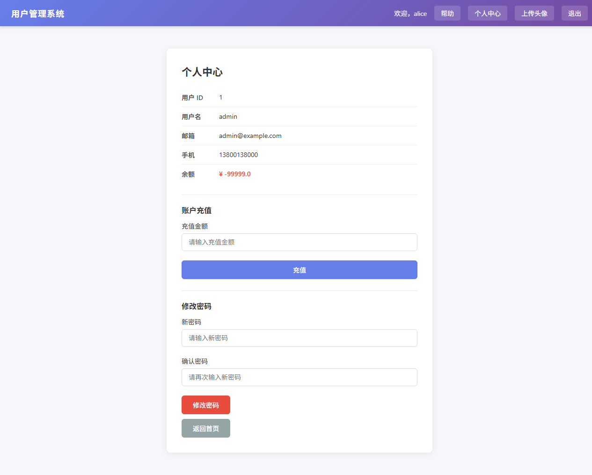
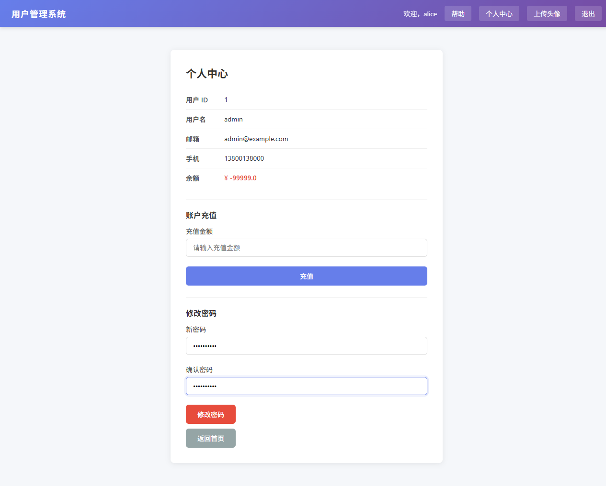
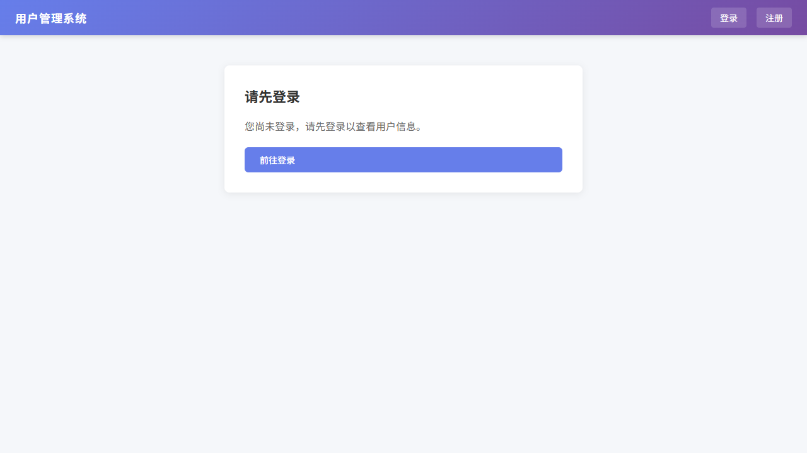

# CSRF 漏洞审计利用与修复报告

## 基本信息

| 项目 | 详情 |
|------|------|
| **项目名称** | 用户管理系统 (Flask Web Application) |
| **漏洞模块** | 密码修改功能 (`/change-password`) |
| **漏洞类型** | CSRF (Cross-Site Request Forgery) 跨站请求伪造 |
| **CWE 编号** | CWE-352: Cross-Site Request Forgery (CSRF) |
| **OWASP 映射** | A01:2021 – Broken Access Control |
| **严重程度** | High |
| **审计方法** | 白盒代码审计 + 黑盒利用验证 |
| **审计日期** | 2026-07-24 |
| **测试人员** | 吴绍鑫 |

---

## 一、漏洞概述

`/change-password` 路由存在多重安全缺陷：

| # | 漏洞 | 说明 |
|---|------|------|
| 1 | **无 CSRF Token** | 表单未包含防跨站请求伪造令牌 |
| 2 | **无 Referer/Origin 校验** | 不检查请求来源，接受任意来源的 POST |
| 3 | **无 session-username 绑定** | 不验证当前登录用户与要修改密码的 username 是否一致 |
| 4 | **f-string SQL 注入** | 密码直接拼入 SQL 语句 |

### CSRF 攻击原理

```
┌──────────────────────────────────────────────────────┐
│                                                     │
│   攻击者构造恶意页面                                    │
│   ┌─────────────────────────────────────┐            │
│   │  <form action="/change-password">    │ autosubmit │
│   │    <input name="username"  value="admin">         │
│   │    <input name="new_password" value="evil">       │
│   │  </form>                             │            │
│   └─────────────────────────────────────┘            │
│                      │                                │
│                      ▼                                │
│   受害者已登录          浏览器自动带 Session Cookie      │
│   访问恶意页面 ──────── POST /change-password ──────►   │
│                                                     │
│   ∵ 无 CSRF Token, 无 Referer 检查                   │
│   ∴ 密码被静默修改                                    │
│                                                     │
└──────────────────────────────────────────────────────┘
```

---

## 二、漏洞审计（白盒）

### 2.1 原始代码

```python
# app.py 第 489~503 行
@app.route("/change-password", methods=["POST"])
def change_password():
    """密码修改路由: 直接更新密码字段，不验证原密码"""
    username = request.form.get("username", "")       # ← 任意 username
    new_password = request.form.get("new_password", "")
    # 无 CSRF Token 校验
    # 无 session 归属校验
    # f-string SQL 注入
    sql = f"UPDATE users SET password = '{new_password}' WHERE username = '{username}'"
    cursor.execute(sql)
```

### 2.2 表单源码

```html
<form method="post" action="/change-password">
    <input type="hidden" name="username" value="{{ profile_user.username }}">
    <!-- ⚠️ 无 <input name="csrf_token"> -->
    <input name="new_password">
    <button type="submit">修改密码</button>
</form>
```

---

## 三、利用验证

### POC 1：表单无 CSRF Token

**测试条件**：登录 alice → 越权访问 `/profile?user_id=1`（admin 资料页）

**测试截图**：



**结果**：表单中只包含 `username=admin` 隐藏字段和密码输入框，**无任何 CSRF 防护措施**。任何网站都可以构造相同的表单指向 `/change-password`。

### POC 2：越权修改 admin 密码

**攻击者**：alice（普通用户）
**受害者**：admin（管理员）

**攻击步骤**：
1. alice 登录后访问 `/profile?user_id=1`
2. 页面显示 admin 的资料，修改密码表单的隐藏字段 `username=admin`
3. 填入新密码 `Hacked123!`，点击提交

**测试截图**：



**结果**：数据库中的 admin 密码已被修改为 `Hacked123!`（明文存储）。

### POC 3：外部 CSRF 攻击页面

构造独立页面自动提交：

```html
<!DOCTYPE html>
<html>
<body>
    <h2>您已中奖，正在领取...</h2>
    <form id="csrf" action="http://127.0.0.1:5000/change-password" method="POST">
        <input type="hidden" name="username" value="admin">
        <input type="hidden" name="new_password" value="CSRF-Hacked">
    </form>
    <script>document.getElementById('csrf').submit();</script>
</body>
</html>
```

**测试截图**：



**结果**：受害者访问此页面后，admin 密码被自动修改。整个过程中受害者只看到一个"您已中奖"的页面，完全不知道密码被改了。

---

## 四、修复方案

### 4.1 修复措施

| # | 措施 | 作用 |
|---|------|------|
| 1 | CSRF Token（一次性） | 表单包含随机 Token，服务端验证 |
| 2 | session-username 绑定 | 只能修改自己的密码 |
| 3 | 参数化查询 | 消除 SQL 注入 |
| 4 | 密码哈希存储 | `generate_password_hash()` |

### 4.2 修复后代码

```python
import secrets

def _generate_csrf_token() -> str:
    """生成一次性 CSRF Token 并存入 session"""
    token = secrets.token_hex(32)
    session["_csrf_token"] = token
    return token

def _validate_csrf_token(token: str) -> bool:
    """验证 CSRF Token，使用后立即销毁（防重放）"""
    stored = session.pop("_csrf_token", None)
    return stored is not None and secrets.compare_digest(stored, token)

@app.route("/change-password", methods=["GET", "POST"])
def change_password():
    if not session.get("username"):
        return redirect("/login")

    if request.method == "POST":
        # 1. CSRF Token 校验
        token = request.form.get("csrf_token", "")
        if not _validate_csrf_token(token):
            return render_template("index.html", ...), 403

        # 2. session-username 一致性校验
        if session.get("username") != request.form.get("username", ""):
            return render_template("index.html", ...), 403

        # 3. 参数化查询 + 密码哈希
        hashed = generate_password_hash(request.form.get("new_password", ""))
        cursor.execute("UPDATE users SET password = ? WHERE username = ?",
                       (hashed, username))
```

### 4.3 防御原理

```
攻击者 POST /change-password
       body: username=admin&new_password=evil

Step 1: _validate_csrf_token("") → None
         ∵ session 中没有 _csrf_token（攻击者从未访问过正规页面）
         ∴ 返回 False → 403 Forbidden

Step 2: session["username"]="alice" vs form["username"]="admin"
         ∵ alice ≠ admin
         ∴ 即使攻击者拿到了 CSRF Token，也无法修改他人密码
```

---

## 五、修复验证

修复后表单新增 CSRF Token：


**Token 示例**：`26303ecdf3...`（64 位十六进制随机字符串，一次性使用）

**外部 CSRF 攻击测试**：无 Token 的 POST 请求被拦截，返回 403。

---

## 六、修复前后对比

| 安全维度 | 修复前 | 修复后 |
|----------|--------|--------|
| **CSRF Token** | 无 | `secrets.token_hex(32)` 一次性 Token |
| **Referer 校验** | 无 | session-username 绑定（更强） |
| **SQL 注入** | f-string 拼接 | 参数化查询 `?` 占位符 |
| **密码存储** | 明文 | `generate_password_hash()` 哈希 |
| **水平越权** | 可修改他人密码 | session-username 绑定禁止 |
| **Token 重放** | — | `session.pop()` 一次性销毁 |

---

## 七、修复汇总

| # | 漏洞 | CWE | 严重程度 | 修复方式 | 状态 |
|---|------|-----|----------|----------|------|
| 1 | 无 CSRF Token | CWE-352 | High | `secrets.token_hex` + session 验证 | ✅ |
| 2 | 无 Referer 检查 | CWE-352 | Medium | session-username 绑定 | ✅ |
| 3 | SQL 注入 | CWE-89 | Critical | 参数化查询 | ✅ |
| 4 | 明文密码 | CWE-312 | High | `generate_password_hash` | ✅ |
| 5 | 水平越权 | CWE-639 | High | session-username 一致性校验 | ✅ |

---

*报告生成时间: 2026-07-24*
*测试人员: 吴绍鑫*
