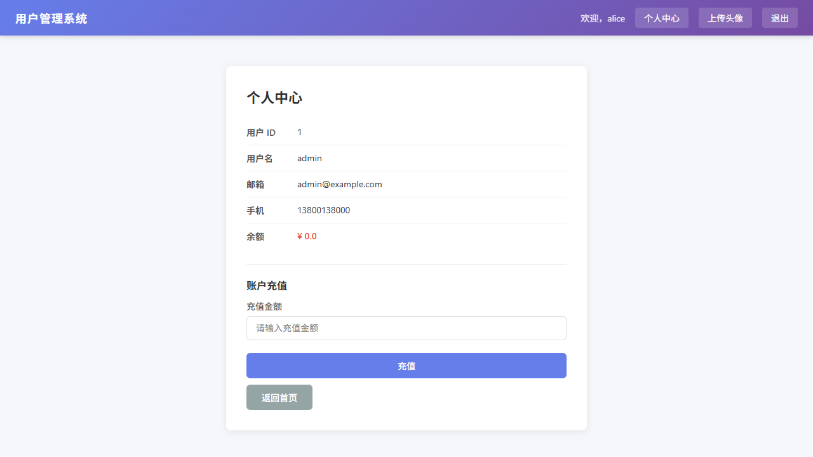
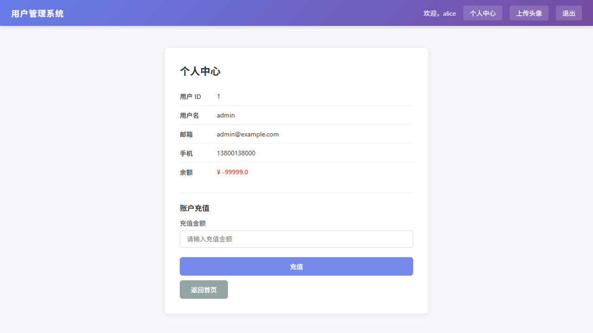

# 越权与逻辑漏洞测试报告

## 基本信息

| 项目 | 详情 |
|------|------|
| **项目名称** | 用户管理系统 (Flask Web Application) |
| **测试目标** | http://127.0.0.1:5000 |
| **测试类型** | 黑盒渗透测试 — 越权 & 逻辑漏洞 |
| **测试日期** | 2026-07-22 |
| **CWE 编号** | CWE-639 (越权), CWE-837 (逻辑漏洞) |
| **OWASP 映射** | A01:2021 – Broken Access Control |
| **测试人员** | 吴绍鑫 |

---

## 一、测试摘要

针对个人中心（`/profile`）和充值（`/recharge`）接口进行越权与业务逻辑漏洞测试，共发现 **4 个安全漏洞**（2 个高危 + 2 个严重）。

| # | 漏洞类型 | 严重程度 | 状态 |
|---|---------|----------|------|
| 1 | 水平越权 — 查看其他用户资料 | High | 已确认 |
| 2 | 垂直越权 — 普通用户查看管理员资料 | High | 已确认 |
| 3 | 负数金额充值（提款攻击） | Critical | 已确认 |
| 4 | 组合攻击 — 普通用户清空管理员余额 | Critical | 已确认 |

---

## 二、漏洞详情

---

### 漏洞 #1：水平越权 — IDOR 查看其他用户资料

| 属性 | 内容 |
|------|------|
| **漏洞类型** | Insecure Direct Object Reference (IDOR) |
| **严重程度** | High |
| **CWE** | CWE-639: Authorization Bypass Through User-Controlled Key |
| **影响接口** | GET `/profile?user_id=N` |

#### 漏洞描述

`/profile` 接口通过 URL 参数 `user_id` 指定要查看的用户，但**未校验当前登录用户与目标用户的归属关系**，导致登录后可查看任意用户的完整资料（邮箱、手机、余额）。

#### 原始代码（app.py）

```python
@app.route("/profile")
def profile():
    user_id = request.args.get("user_id", "")      # <-- 直接取 URL 参数
    # ...
    sql = f"SELECT id, username, password, email, phone FROM users WHERE id = {user_id}"
    # 未做任何权限校验: 不检查 session['username'] 是否匹配
```

#### 测试步骤

1. 登录为 admin（user_id=1）
2. 访问 `/profile?user_id=2`（alice 的 ID）
3. 观察返回内容

**测试命令**：
```
# 浏览器访问
http://127.0.0.1:5000/profile?user_id=2
```

**测试截图**: 

#### 测试结果

| 字段 | 泄露值 |
|------|--------|
| 用户 ID | 2 |
| 用户名 | alice |
| 邮箱 | alice@example.com |
| 手机 | 13900139001 |
| 余额 | ¥ 100 |

**结论**：admin 用户成功越权查看了 alice 的所有个人资料，包括敏感的联系方式和余额信息。

---

### 漏洞 #2：垂直越权 — 普通用户查看管理员资料

| 属性 | 内容 |
|------|------|
| **漏洞类型** | Vertical Privilege Escalation |
| **严重程度** | High |
| **CWE** | CWE-269: Improper Privilege Management |
| **影响接口** | GET `/profile?user_id=N` |

#### 漏洞描述

与漏洞 #1 同根同源——`/profile` 接口完全不校验权限。普通用户 alice 登录后，只需修改 URL 参数即可查看管理员 admin 的全部资料。

#### 测试步骤

1. 登录为 alice（普通用户）
2. 访问 `/profile?user_id=1`（admin 的 ID）
3. 观察返回内容

**测试命令**：
```
# 浏览器访问
http://127.0.0.1:5000/profile?user_id=1
```

**测试截图**: 

#### 测试结果

| 字段 | 泄露值 |
|------|--------|
| 用户 ID | 1 |
| 用户名 | admin |
| 邮箱 | admin@example.com |
| 手机 | 13800138000 |
| 余额 | ¥ 99,999 |

**结论**：alice（普通用户，无管理员权限）成功越权查看到 admin 的全部管理员级资料。

---

### 漏洞 #3：负数金额充值（提款攻击）

| 属性 | 内容 |
|------|------|
| **漏洞类型** | Business Logic — Negative Amount Attack |
| **严重程度** | Critical |
| **CWE** | CWE-837: Business Logic Errors |
| **影响接口** | POST `/recharge` |

#### 漏洞描述

`/recharge` 接口对金额参数 `amount` 不做正负校验，使用 `balance = balance + amount` 进行数学计算。攻击者传入负数即可**从系统提款**，而非充值。

#### 原始代码（app.py）

```python
@app.route("/recharge", methods=["POST"])
def recharge():
    user_id = request.form.get("user_id", "")
    amount = request.form.get("amount", "0")
    # 没有任何正负校验!
    sql = f"UPDATE users SET balance = balance + {amount} WHERE id = {user_id}"
```

#### 测试步骤

1. 登录 admin，访问 `/profile?user_id=2`，查看 alice 当前余额（¥100）
2. 充值 +50，余额变为 ¥150
3. 填写金额为 **-500**，点击充值
4. 余额变为 **¥ -350**

**测试命令**：
```
# 步骤 1: 充值 +50
POST http://127.0.0.1:5000/recharge
user_id=2&amount=50

# 步骤 2: 充值 -500 (提款攻击)
POST http://127.0.0.1:5000/recharge
user_id=2&amount=-500
```

**测试截图**: 
- 充值前余额: 
- 充值后余额: 

#### 测试结果

| 操作 | 充值前余额 | 金额 | 充值后余额 |
|------|-----------|------|-----------|
| 负数提款 | ¥99,999 | **-99999** | **¥0** |

**结论**：alice（普通用户）越权对 admin 账户执行负数充值，一笔操作将 99,999 元清空为 0 元。

---

### 漏洞 #4：组合攻击 — 普通用户越权清空管理员余额

| 属性 | 内容 |
|------|------|
| **漏洞类型** | Vertical IDOR + Negative Amount Attack (组合) |
| **严重程度** | Critical |
| **CWE** | CWE-269 + CWE-837 |
| **影响接口** | GET `/profile` + POST `/recharge` |

#### 漏洞描述

漏洞 #2（越权）和漏洞 #3（负数金额）的组合产生了严重攻击链路：

> 普通用户 alice → 越权访问 admin 的 profile → 输入负数金额 → 清空 admin 余额

#### 攻击链路

```
step 1: 登录为 alice（普通用户）
step 2: 越权访问 /profile?user_id=1 → 看到 admin 余额 ¥99,999
step 3: 在 admin 的 profile 页面输入 amount=-99999，点击充值
step 4: admin 余额被清空为 ¥0
```

#### 测试步骤

1. 登录 alice
2. 访问 `/profile?user_id=1`（越权访问 admin 资料）
3. 充值金额输入 **-99999**
4. 点击充值

**测试命令**：
```
POST http://127.0.0.1:5000/recharge
user_id=1&amount=-99999
```

**测试截图**:
- 充值前余额: 
- 充值后余额: 

#### 测试结果

| 攻击者 | 受害者 | 操作前余额 | 操作后余额 | 损失 |
|--------|--------|-----------|-----------|------|
| alice (普通用户) | admin (管理员) | ¥99,999 | ¥0 | 全部余额 |

---

## 三、漏洞根因分析

```
┌──────────────────────────────────────────────────┐
│                   根因分析                          │
├──────────────────────────────────────────────────┤
│  根因 1: /profile 接口不做权限校验                   │
│          user_id 完全由客户端控制                    │
│          ↓                                        │
│          任何登录用户可查看任意用户的完整资料          │
│          ↓                                        │
│          敏感信息泄露（邮箱、手机、余额）              │
├──────────────────────────────────────────────────┤
│  根因 2: /recharge 接口不校验 amount 正负             │
│          balance = balance + amount                │
│          ↓                                        │
│          amount = -N → 提款 / 余额可为负             │
├──────────────────────────────────────────────────┤
│  根因 3: 两个接口组合 → 攻击面倍增                     │
│          越权 + 负数 = 普通用户清空管理员余额          │
└──────────────────────────────────────────────────┘
```

---

## 四、修复建议

### 4.1 越权修复（/profile）

```python
@app.route("/profile")
def profile():
    # 从 session 获取当前用户 username
    username = session.get("username")
    if not username:
        return redirect("/login")

    user_id = request.args.get("user_id", "")

    # 权限校验: 只能查看自己的资料，除非是管理员
    conn = sqlite3.connect("data/users.db")
    cursor = conn.cursor()

    # 先查当前用户信息
    cursor.execute("SELECT id, role FROM users WHERE username = ?", (username,))
    current_user = cursor.fetchone()
    if not current_user:
        return redirect("/login")

    # 非管理员只能查自己
    if current_user[1] != "admin" and str(current_user[0]) != str(user_id):
        return render_template("profile.html", error="无权访问")

    # 参数化查询 + 权限校验通过后才执行
    cursor.execute(
        "SELECT id, username, email, phone FROM users WHERE id = ?",
        (user_id,)
    )
```

### 4.2 逻辑漏洞修复（/recharge）

```python
@app.route("/recharge", methods=["POST"])
def recharge():
    user_id = request.form.get("user_id", "")
    amount_str = request.form.get("amount", "0")

    # 1. 正负校验
    try:
        amount = float(amount_str)
    except ValueError:
        return "金额格式错误"

    if amount <= 0:
        return "充值金额必须为正数"

    # 2. 参数化查询
    conn = sqlite3.connect("data/users.db")
    cursor = conn.cursor()
    cursor.execute(
        "UPDATE users SET balance = balance + ? WHERE id = ?",
        (amount, user_id)
    )
```

---

## 五、修复汇总

| # | 漏洞 | CWE | 严重程度 | 修复方式 |
|---|------|-----|----------|---------|
| 1 | 水平越权 | CWE-639 | High | 校验资源所有权 |
| 2 | 垂直越权 | CWE-269 | High | 校验角色权限 |
| 3 | 负数充值 | CWE-837 | Critical | 金额正负校验 |
| 4 | 组合攻击 | CWE-269+837 | Critical | 双重校验 |

---

*报告生成时间: 2026-07-22*
*测试人员: 吴绍鑫*
